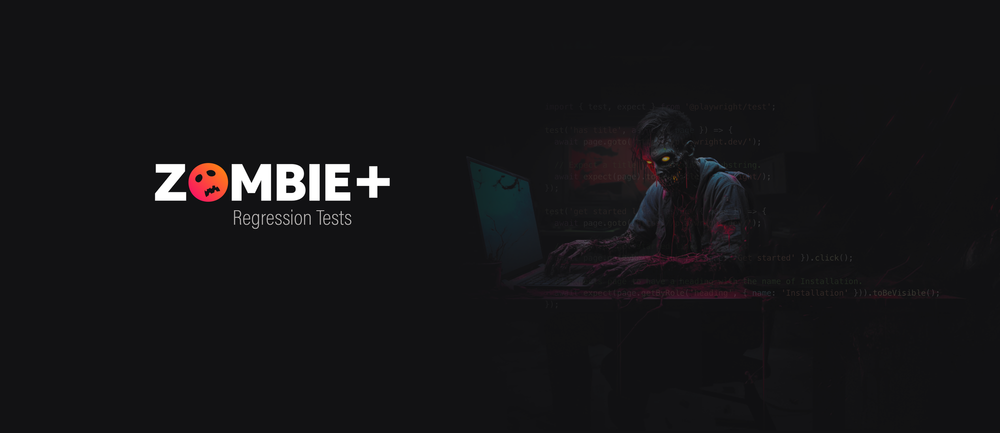

# Robot Framework E2E Test Project for ZombiePlus

This project is an automated test suite for ZombiePlus, a zombie-themed movie and series streaming service. The tests are written using Robot Framework and the Browser library, as a learning exercise after having previously automated the same system using Playwright ([repository](https://github.com/ecureuill/zombieplus-playwright)). This project aims to achieve the same level of test coverage as the Playwright project.

This project demonstrates how to adapt POM and componentization concepts within Robot Framework limitations. By adopting this organized structure, ZombiePlus-Robot achieves well-structured, maintainable, and reusable test automation, contributing to efficient and reliable testing practices.

## Table of Contents

- [Tech Stack and Their Roles](#tech-stack-and-their-roles)
- [Project Structure](#project-structure)
- [Testing Coverage](#testing-coverage)
  - [Smoke Tests](#smoke-tests)
  - [Special Character Testing for Movies](#special-character-testing-for-movies)
- [Test Execution](#test-execution)
- [Page Objects and Componentization](#page-objects-and-componentization)
- [API Requests and DataBase queries](#api-requests-and-database-queries)
- [Test Data](#test-data)
  - [Creating and Maintaining Test Data](#creating-and-maintaining-test-data)
  - [AI-Assisted Test Data Generation](#ai-assisted-test-data-generation)
  - [Benefits of AI-Assisted Test Data Generation](#benefits-of-ai-assisted-test-data-generation)
- [ZombiePlus Access](#zombieplus-access)
- [Feedback and Questions](#feedback-and-questions)
----------------

## Tech Stack and Their Roles
- **Robot Framework**: A generic test automation framework for acceptance testing and acceptance test-driven development (ATDD). It provides the structure for organizing and executing tests.
- **Browser Libray**: A Robot Framework library for browser automation. It allows for interaction with web pages, simulating user actions like clicking, typing, and navigating.
- **Requests Library**: A Robot Framework library for making HTTP requests.
- **JSON Library**: A Robot Framework library for handling JSON data. 
- **PyYAML**: A Python library for parsing YAML files. It's used for reading the project's configuration files.
- **psycopg2**: A PostgreSQL adapter for Python. It's used for interacting with the ZombiePlus database.

## Project Structure
```
zombieplus-robot/
├── resources/
│   ├── fixtures/
│   │   └── data/
│   │       ├── covers/
│   │       │   ├── movies/
│   │       │   └── tvshows/
│   │       ├── leads.json
│   │       ├── login.json
│   │       ├── movies.json
│   │       └── tvshows.json
│   ├── libs/
│   │   └── Database.py
│   ├── config.py
│   ├── env.yaml
│   ├── helpers.resource
│   └── services.resource 
├── pages/
│   ├── components/
│   │   ├── ModalComponent.ts
│   │   └── ...
│   ├── HomePage.ts
│   └── ... 
├── tests/
│   └── e2e/ 
│       ├── admin/
│       │   ├── movies/
│       │   │   ├── create.robot
│       │   │   ├── delete.robot
│       │   │   ├── navigation.robot
│       │   │   └── search.robot
│       │   ├── tvshows/
│       │   └── leads/
│       └── home/ 
│             ├── featured.robot
│             ├── leads.robot
│             └── navigation.robot
├── requirements.txt
└── ...
```
The project is organized into several directories, each serving a specific purpose:

- **resources/**: Contains the project's resources, like test data and helper scripts.
- **pages/**: Contains the page objects used in the tests. Each page object represents a web page in the ZombiePlus application and provides methods for interacting with that page.
- **tests/**: Contains the actual test cases. Each test case is a Robot Framework script that uses the page objects and resources to perform actions on the ZombiePlus application and verify its behavior.

## Testing Coverage

This project aims to achieve comprehensive testing coverage for the ZombiePlus application.


1. Home Page
    - Test the display of featured movies / tvshows on the home page.
    - Test successful lead creation with valid details. (smoke)
    - Test unsuccessful lead creation with duplicate email.
    - Test unsuccessful lead creation with invalid data (blank name and/or email; invalid email).
1. Admin Login Page
    - Test successful login with valid credentials. (smoke)
    - Test unsuccessful login with invalid credentials. (smoke)
    - Test unsuccessful login with empty credentials (blank password and/or email; invalid email).
1. Movies Page
    - Test successful movie creation with valid details.(smoke)
    - Test successful movie creation with special characters.
    - Test unsuccessful movie creation with duplicate title.
    - Test unsuccessful movie creation without required details.
    - Test successful movie deletion. (smoke)
    - Test successful movie search with existing title. (smoke)
    - Test successful movie search with special characters.
    - Test unsuccessful movies search with non-existing title.
1. TV Shows Page
    - Test successful tv shows creation with valid details. (smoke)
    - Test unsuccessful tv shows creation with duplicate title.
    - Test unsuccessful tv shows creation without required details.
    - Test successful tv shows deletion. (smoke)
    - Test successful tv shows search with existing title. (smoke)
    - Test unsuccessful tv shows search with non-existing title.
1. Leads Page
    - Test successful lead deletion. (smoke)
    - Test successful lead search with existing email. (smoke)

### Smoke Tests
In this project, we use the tag `smoke` to define smoke tests. **Smoke tests** are a subset of the test suite that are designed to quickly verify that the basic functionality of the application is working correctly. They are often used as a first step in the testing process to catch any major issues before more detailed testing is performed.

### Special Character Testing for Movies

This project includes comprehensive tests that specifically focus on how the application handles movies with titles containing special characters. These tests cover a wide range of scenarios, including:

* Creating movies and TV shows with titles containing common special characters (e.g., @, #, $, %, &, !, *).
* Creating movies and TV shows with titles containing non-breaking spaces and other unusual characters.
* Searching for movies and TV shows with titles containing special characters.
* Verifying that special characters are displayed correctly in the UI.
* Verifying that special characters are stored correctly in the database.

These tests help ensure that the application can handle a wide range of input data and that special characters do not cause any unexpected behavior.


**Examples of tested special characters:**

- Emoji: 🧟
- Extended ASCII characters: `Æ Ð Þ ñ ô`
- Newline character: `\n`
- Non-breaking space:  
- Right-to-left mark: `\u200F`
- SQL special character: `
- HTML escape character: `<`
- Japanese characters: `テスト映画`


## Test Execution
Following are the steps to clone and run this project:

```bash
# 1. Clone the project repository from GitHub:
git clone https://github.com/ecureuill/zombieplus-robot.git
# 2. Navigate to the cloned directory:
cd zombieplus-robot
# 3. Install the required dependencies:
pip install -r requirements.txt
# 4. Create env file
cat > .env.yaml << EOF
DB_HOST=[REPLACE IT]
DB_NAME=[REPLACE IT]
DB_USER=[REPLACE IT]
DB_PASS=[REPLACE IT]
DB_PORT=[REPLACE IT]

API_HOST=http://localhost:3333
API_USER=admin@zombieplus.com
API_PWD=pwd123

FRONT_HOST=http://localhost:3000
EOF
# 5. Run the tests
robot -d logs/ tests/
```
> **Important:** Replace the placeholder values with your actual credentials and API endpoints. Do not commit the `.env.yaml` file to a public repository.

That's it! The tests will now run and you will see the results in your terminal.

Please note that you need to have Python and pip installed on your machine to run this project.

## Page Objects and Componentization

This project aims to achieve the benefits of the Page Object Model (POM) and componentization within the limitations of Robot Framework. While true classes aren't available, we can implement similar concepts through effective organization and data-driven techniques.

### Project Structure Highlights:

- Data-Driven Approach:
    - resources/fixtures/data: Stores various test data in JSON format, including covers, leads, login credentials, movies, and tvshows.
    - Parametrized keywords access and utilize this data for dynamic test execution, enhancing reusability and efficiency.
- Modular Component Libraries:
    - resources/libs: Houses libraries implementing essential functions like database interactions.
    - Each library encapsulates relevant logic, promoting modularity and code maintainability.
- Page Object Representation:
    - pages: Simulates a page object structure using separate files for each page or component.
    - pages/components: Holds reusable component-specific keywords (e.g., ModalComponent.ts).
- Organized Test Suite:
    - tests/e2e: Maintains test cases categorized by functionality and target areas (admin, home, etc.).
    - Subdirectories further organize tests based on specific features within each area (e.g., movies, tvshows).
    - Individual *.robot files capture distinct test scenarios, promoting clarity and easy navigation.

### Benefits of This Structure:

- **Enhanced Readability**: Clear organization and descriptive data files improve understanding.
- **Optimized Reusability**: Modular libraries and parametrization enable efficient code reuse.
- **Simplified Maintenance**: Well-defined structure facilitates locating and addressing changes.
- **Elevated Testability**: Focused keywords within page files allow for granular test execution.

## API Requests and DataBase queries

The database state is cleaned to ensure a consistent testing environment before each test. This is done using the `psycopg2` package to interact directly with the PostgreSQL database.

In addition, some tests insert records into the database using the ZombiePlus API. This allows the tests to run quickly, without the need to interact with the user interface.

## Test Data

The test data for this project is stored in separate files for each feature of the application. For example, the data for creating, deleting, and searching for leads is stored in the leads.json file, while the data for registering and managing movies is stored in the movies.json file.

Using separate files for each feature has several advantages. It makes the tests easier to write and maintain, as the test data can be updated in a single location for each feature. It also allows the tests to be run with a variety of data, which can reveal bugs that would not be discovered otherwise.

Moreover, this approach allows us to simulate different user behaviors and scenarios more realistically, contributing to more robust and reliable tests.

### Creating and Maintaining Test Data

Test data creation involves identifying various use cases and edge cases relevant to each feature. Data is carefully crafted to represent expected user behavior, potential errors, and boundary conditions. The use of JSON files allows for easy editing and version control, facilitating updates as the application evolves.

By diligently maintaining and expanding the test data set, we ensure comprehensive coverage of various user interactions and system responses, strengthening the overall quality and reliability of the automated test suite.

### AI-Assisted Test Data Generation

This project leverages the power of artificial intelligence (AI) to create and augment test data. Specifically, we utilize the capabilities of Gemini and ChatGPT to generate realistic and diverse data sets, including generate images for movie and TV show titles.

#### Benefits of AI-Assisted Test Data Generation
- Increased Efficiency: AI-powered tools can significantly reduce the time and effort required to create and maintain test data.
- Enhanced Data Diversity: AI can generate a wider range of data than manual methods, covering a broader spectrum of use cases and edge cases.
- Improved Data Quality: AI tools can help identify and eliminate inconsistencies and errors in test data, ensuring higher data quality.

### ZombiePlus Access
ZombiePlus system is not publicly available. This project is intended to be used by those who have access to the ZombiePlus system provided in the [QaXperience course](qax.com). If you do not have access to this system, you will not be able to run the tests in this project.

## Feedback and Questions

I'm still learning test automation, so I'd appreciate your feedback and questions on this project. Your insights will help me improve my skills and understanding of Playwright and E2E testing.